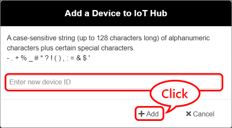
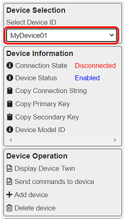
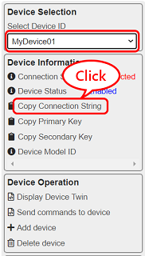
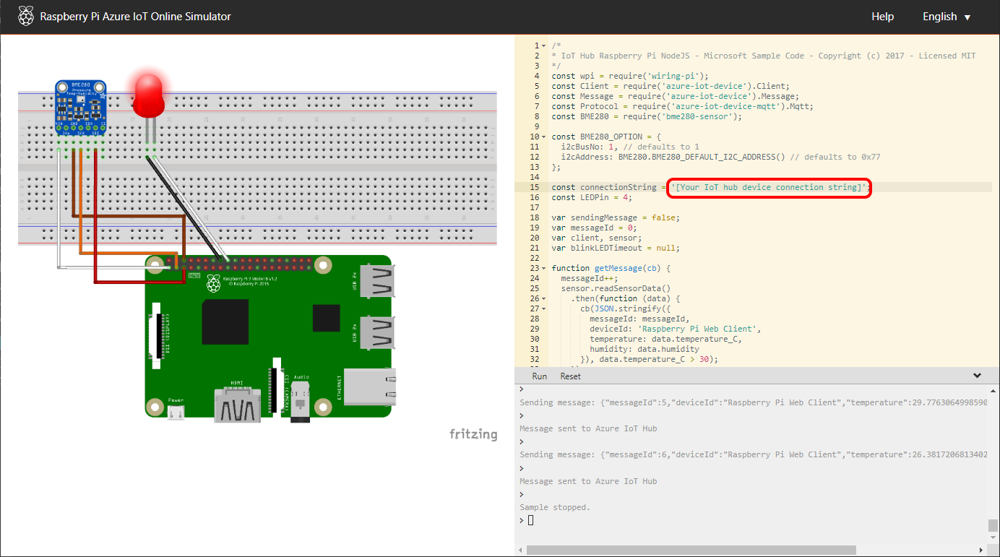
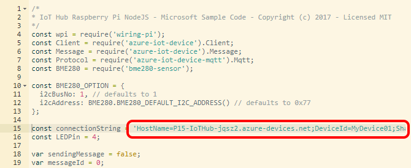
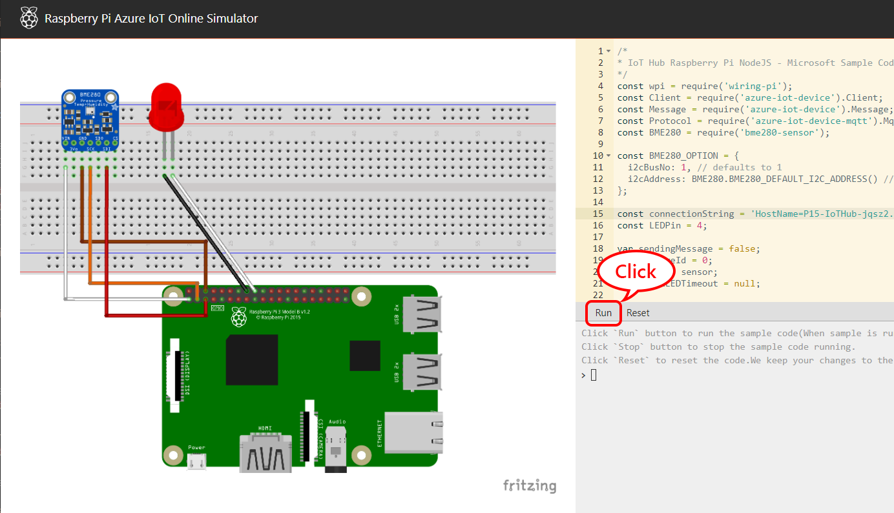
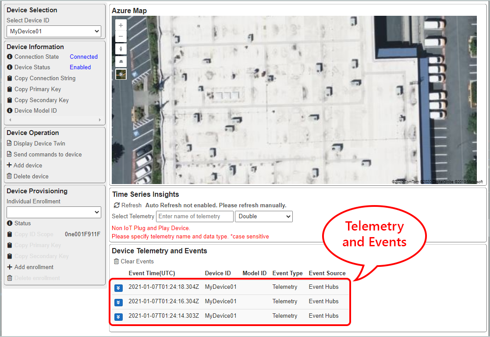
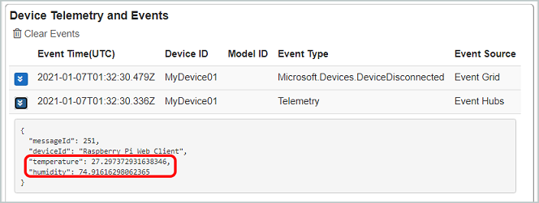
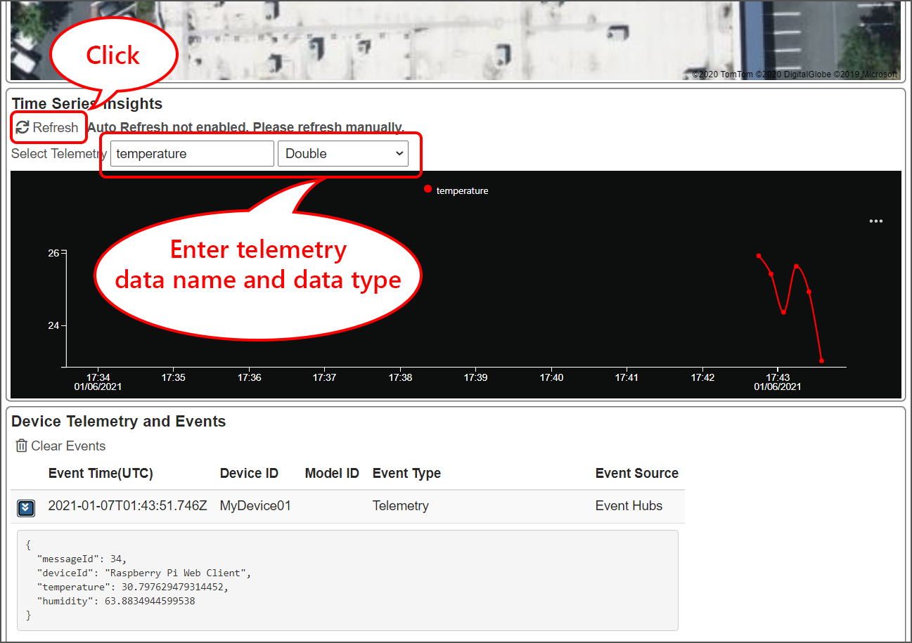

# Connect IoT devices to the Open Platform

This document walks through :

1. Provisioning a device to Open Platform
1. Visualizing data from devices

## Requirements

- A PC with web browser
- Optional : A device to connect to Open Platform solution  
    - If you do not have any of following devices, you may use Raspberry Pi Web Simulator
    - Raspberry Pi  
    - Seeed WIO Terminal
    - A PC with Linux

## Provisioning a device to Open Platform

In order to consume (e.g. visualize) data from a device, the device must be provisioned.  Provisioning device means :

1. Creating device identity in IoT Hub
1. Prepare a device
1. Authenticating the device
1. Establishing a connection

### 1 : Creating a device identity in IoT Hub

A device must be known to the solution.  Creating a device identity means registering a device entity in IoT Hub.

1. In Open Platform Portal, click `Add Device`  

    

1. Enter a new device ID  

    E.g. MyDevice01

    

1. Make sure the device is added to the list  

    

### 2. Preparing a device

Each device firmware/device app has their own way of programming authentication information.  For this demo, we will use [Raspberry Pi Azure IoT Online Simulator](https://azure-samples.github.io/raspberry-pi-web-simulator/).

1. Browse to **Raspberry Pi Azure IoT Online Simulator** with your browser  
1. Select the new device you created above
1. Click `Copy Connection String` to copy connection string into clipboard

    

1. Replace `[Your IoT hub device connection string]` with the connection string

    

    > [!IMPORTANT]  
    > Ensure the connection string is inside single quotes `` ` `` `` ` ``
    >
    > Correct  
    > const connectionString = `` ` ``HostName=P15-IoTHub-jq.......`` ` ``;
    >
    > Incorrect  
    > const connectionString = HostName=P15-IoTHub-jqs.......;

    Example :

    

### 3. Connecting the simulator to Open Platform

A device with authentication information (Connection String) can connect to IoT Hub.

1. Click `Run` button to connect and start sending simulated telemetry to Open Platform.

    

1. Switch to Open Platform portal  

    Confirm telemetry and events are pushed to the portal

    

## Visualizing telemetry

Open Platform pushes raw telemetry data to the web site using SignalR, as well as store them into TSI.

You can visualize telemetry from the device by querying TSI and draw a line chart.

Without IoT Plug and Play support, you **must** know the name of telemetry data and data type (Double or Long).

- Telemetry data name  

    You can find telemetry data name in raw data.  Expand telemetry entry in the portal to see data name.

    E.g. with Raspberry Pi Simulator, telemetry names are `temperature` and `humidity`

    

- Telemetry data type  

    TSI support `Long` and `Double`.

To visualize telemetry from Non IoT Plug and Play device, you must specify these information to send query to TSI.

1. Enter telemetry data name
1. Select telemetry data type
1. Click `Refresh` to show telemetry in a line chart  

    

## Next Step

- Developers : Learn more technical details of the Open Platform Open Platform Developer Guide : [Architecture Overview](../Developer-Guide/Architecture-Overview.md)

[Project 15 from Microsoft - Open Platform](../README.md)
