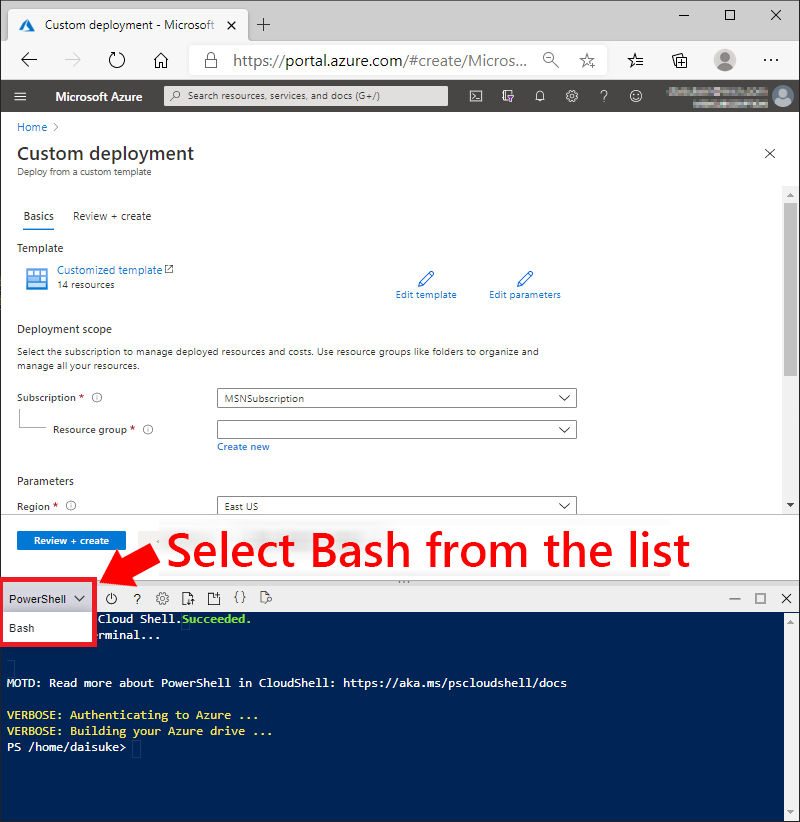
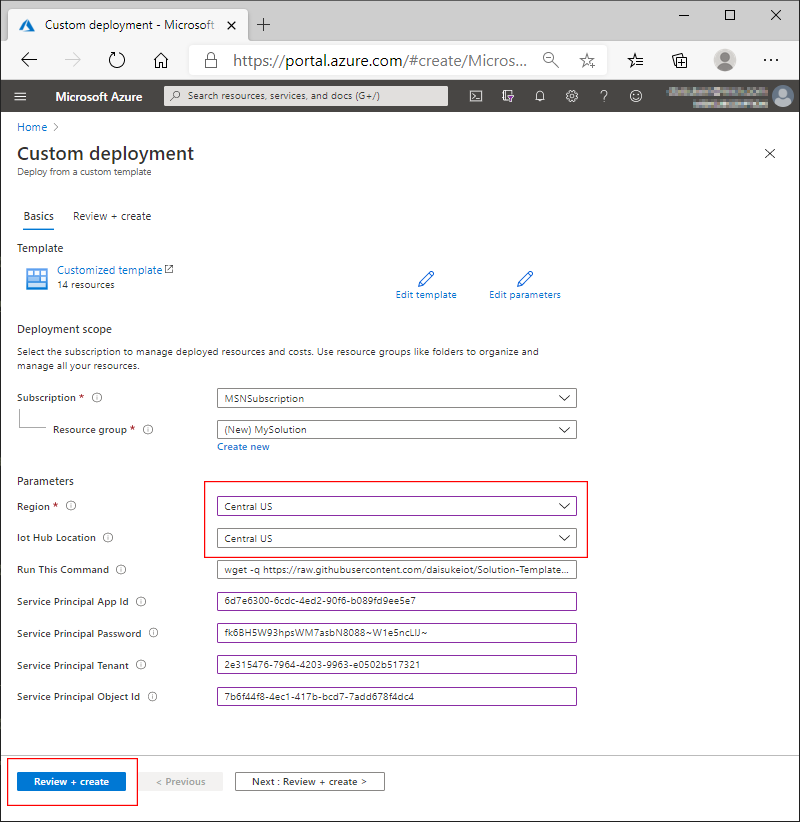
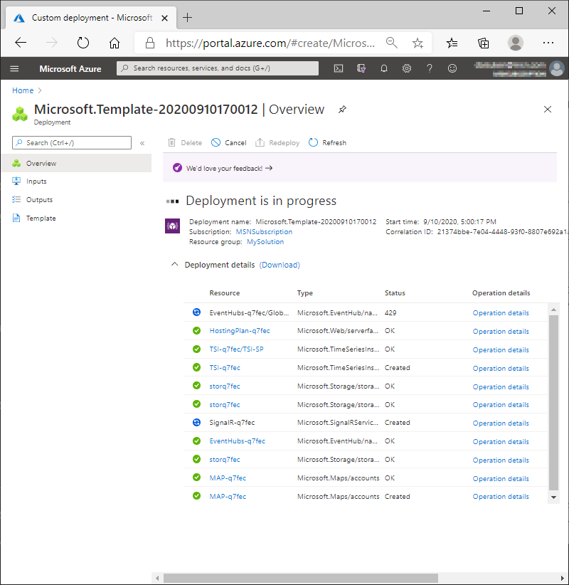
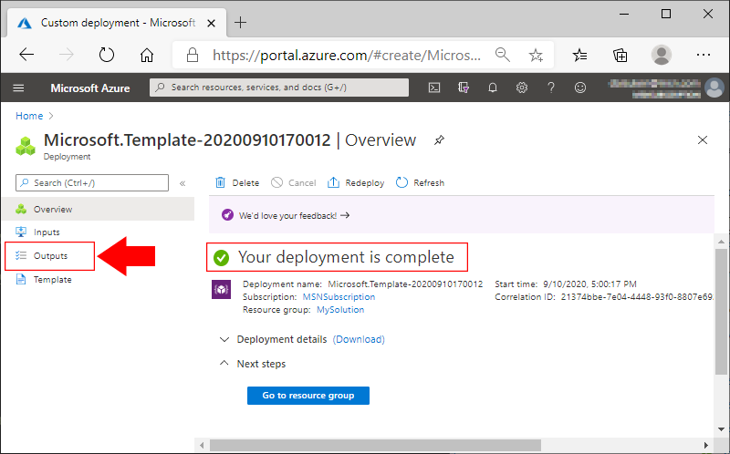
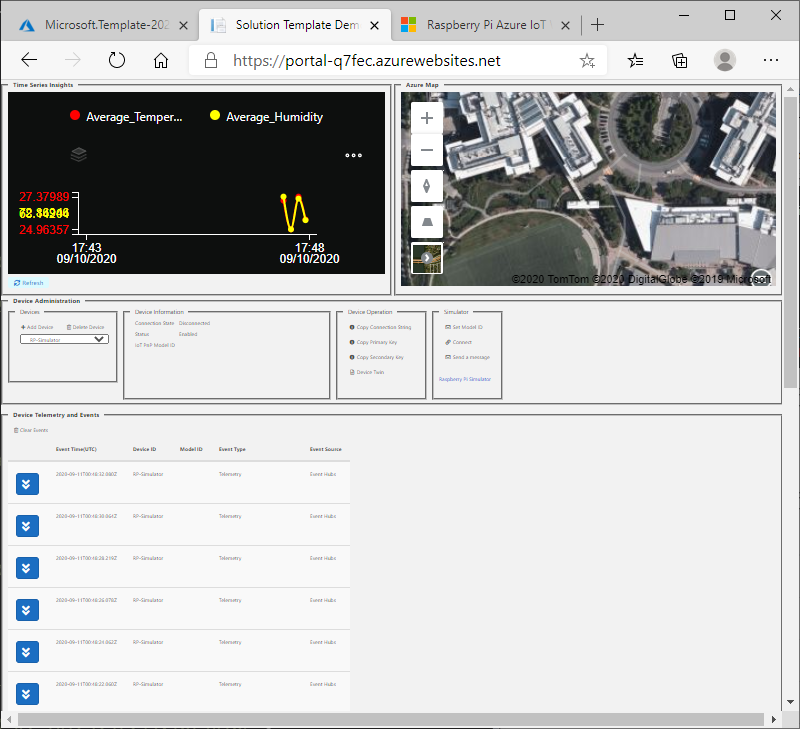

# Deploying Project 15 from Microsoft Open Platform

This document walks through :

- How to deploy Project 15 from Microsoft Open Platform
- Basic navigation using Raspberry Pi emulator

## Requirements

- Azure Subscription  
    If you do not have Azure Subscription, please create an account for free (12 months)  
    <https://azure.microsoft.com/free/>  
    You must be an administrator or an owner of the subscription  
- A PC with Web Browser
- Raspberry Pi 4 + Sensehat (Optional)

## 1. Start Deployment

Click **Deploy to Azure** button below  

<a href="https://portal.azure.com/#create/Microsoft.Template/uri/https%3A%2F%2Fraw.githubusercontent.com%2Fmicrosoft%2Fproject15%2Fmaster%2FDeploy%2Fazuredeploy.json" target="_blank"></a>

> [!TIP]  
> Right click the button below and select **Open link in new tab** or **Open lin in new window**

## 2. Start Cloud Shell

> [!NOTE]  
> Azure Time Series Insights (TSI) requires implicit access permission using Azure Active Directory.  
> Currently there is no easy way to configure Azure Active Directory though the Azure Resource Manager (ARM) template, therefore, we are asking you to take a number of small manual steps as a temporary solution.  
> Step 2 ~ 4 are temporary workaround for TSI deployment

An Azure service principal is a security identity used by user-created apps, services, and automation tools to access specific Azure resources.  Instead of having to manage access permission for each user, the web site will use the Service Principal to access data from TSI.

1. When you are at **Custom Deployment** page, open **Cloud Shell**

    

1. Make sure to select **bash** in the dropdown list on the top left corner to Cloud Shell

    

    You may see a warning message.  Please click **Confirm** to switch to **Bash**

    

## 3. Create Service Principal

In Cloud Shell, copy & paste the entire block below

```bash
wget -q https://raw.githubusercontent.com/microsoft/project15/master/Deploy/tsi-setup.sh -O ./tsi-setup.sh --no-cache && chmod +x tsi-setup.sh && ./tsi-setup.sh
```

You may copy the command from the **Run this command** field.

> [!TIP]
> To paste into Cloud Shell console, right click in Cloud Shell pane, then select paste.


Once the command completes, you will find 4 output lines in the Cloud Shell. This process takes roughly a minute.  


> [!TIP]  
> If you encounter permission error(s), please make sure you are the administrator or the owner of the account.

> [!TIP]  
> If you have multiple subscriptions, please make sure to set account before running above commands with :
>  
> ```bash  
> az login  
> az account set --subscription <Your Subscription Name or ID>  
>```

## 4. Enter Service Principal Information into the Template

Now provide Service Principal IDs and password into the template.

Copy & paste **Service Principal App Id**, **Service Principal Password**, **Service Principal Tenant Id**, and **Service Principal Object Id** into respective input boxes.


## 5. Start Deployment

1. Select **Subscription** (if you have more than one)
1. Create a new **Resource Group** by clicking **Create new**  

    e.g. **MySolution**

    

1. Select **Region** , then click **Review + create**  

    

1. Review all parameters are filled, then click **Create** to start deployment

    

1. Wait for ~ 15 minutes for the deployment to complete

    

## 5. Post Deployment

1. Once deployment is complete, click on **Outputs**

    

1. Click the button to copy **Post Deployment Command**, then right click in Cloud Shell window to paste the command

    

    > [!NOTE]  
    > If Cloud Shell is disconnected for timeout, click **Reconnect**

1. Hit **Enter** key to run the command

    > [!NOTE]  
    > The command does not display any output.

1. After the command completes, copy **Web Site Address** and open in a new browser window or tab to see the sample portal site

    

## Sample Portal Site

The sample portal site has 4 big sections.


- Azure Time Series Insights (TSI)  

    Telemetry and events from devices are sent to TSI.  
    This sample reads Temperature and Humidity data stored in TSI, and displays line charts

    More information on TSI : <https://docs.microsoft.com/en-us/azure/time-series-insights/overview-what-is-tsi>

- Azure Maps

    For solutions to integrate location based services (e.g. GPS).  The sample only displays map.

- Device Management  

    Examples of how to register, delete, retrieve device information.  

    > [!NOTE]  
    > Currently the sample does not provide a way to interact with Device Provisioning Service.

- Device Telemetry and Events  

    Examples of how to receive real-time data from the backend system.  Receives and displays all device telemetry and events.

## Send Temperature from Raspberry Pi Simulator

1. Click on **+Add Device**

    

1. Give a name to a new device, then click **+Add**  

    E.g. RP-Simulator

    > [!TIP]  
    > The name is called **Device ID**.  
    > A case-sensitive string (up to 128 characters long) of alphanumeric characters plus certain special characters: - . + % _ # * ? ! ( ) , : = @ $ '

    

1. Make sure the device just created is selected in the list, and the device is in **Enabled** state.  

    Click on **Copy Connection String**.  
    We will use this later with Raspberry Pi simulator.

    

1. Click on **Raspberry Pi Simulator**

    

    This will open a new browser tab.

    

1. Browse to line #15 in the top right pane, and replace **[Your IoT hub device connection string]** with the connection string

    

    

    The line should look like :

    ```c
    const connectionString = 'HostName=Hub-q7fec.azure-devices.net;DeviceId=RP-Simulator;SharedAccessKey=)(*)()(*)()()=';
    ```

1. Click **Run** to start sending Temperature and Humidity data

    

1. Open the web app from the solution, then click **Refresh** to see temperature and humidity data in line graph

    

## Connecting a real device

If you have Raspberry Pi and SenseHat, please visit <https://github.com/daisukeiot/RP4-SenseHat-PnP/tree/WIP>

## Next Step

- Developers : Learn more technical details of the Open Platform Open Platform Developer Guide : [Architecture Overview](../Developer-Guide/Architecture-Overview.md)

[Project 15 from Microsoft - Open Platform](../README.md)
