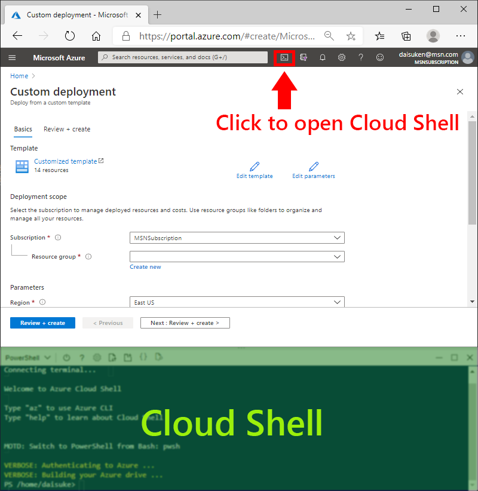
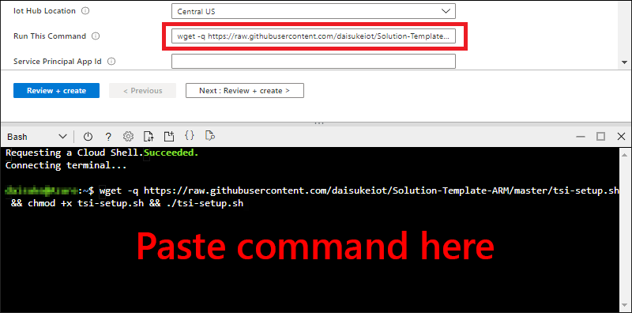
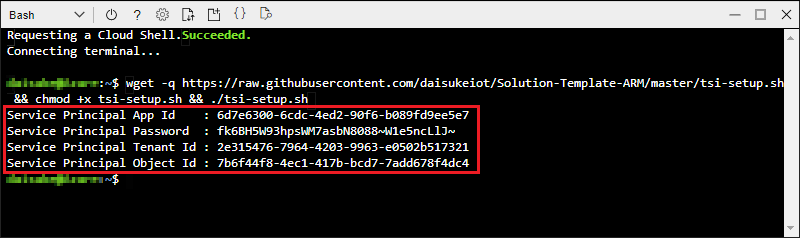
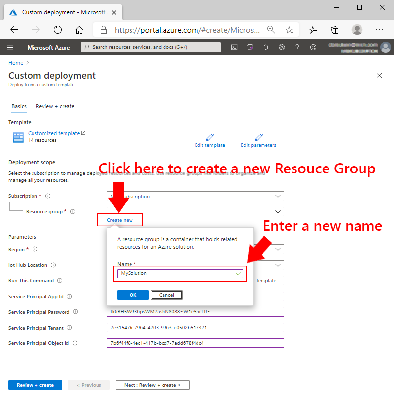
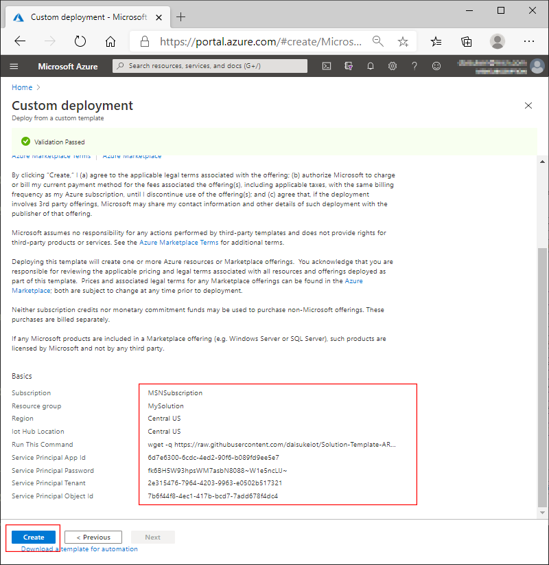

# Deploying Project 15 from Microsoft Open Platform

This document walks through :

- How to deploy Project 15 from Microsoft Open Platform

## Requirements

- Azure Subscription  
    If you do not have Azure Subscription, please create an account for free (12 months)  
    <https://azure.microsoft.com/free/>  
    You must be an administrator or an owner of the subscription  
- A PC with Web Browser

## 1. ARM Template Deployment

Click **Deploy to Azure** button below  

> [!TIP]  
> Right click the button below and select **Open link in new tab** or **Open lin in new window**

## 2. Deploy Open Platform solution

A resource group is a container that holds related resources for an Azure solution. Similar to folder and files.

1. Select Subscription (if you have more than one)  

    

1. Open the dialog box by clicking `Create new`

1. Give a name to the new resource group, then click `OK` to create a new resource group

    E.g. MyOpenPlatformSolution

    

1. Select Region

    

1. Select Unique ID  

    Some Azure services and names such as web site URL require globally unique ID.  The default is a random string based on the resource group.  You may enter your own unique ID string.

    - Minimum 5 characters
    - Maximum 12 characters
    - Alphanumberic characters only (no special characters)

    

1. Click `Review + create`  

    Azure Resource Manager performs validations

1. Click `Create` to start deployment
1. Wait for deployment to complete  

    Typically the deployment process takes about 15 minutes.

    

1. Ensure there is no error reported

    

## 3. Post Deployment

Some Azure services require additional settings, such as permission and access control. We will complete deployment by running a script in Cloud Shell.

1. Switch to `Outputs`
1. Copy `postDeploymentCommand` by clicking blue button next to the command line

    

1. Launch Cloud Shell  

    Open a new browser tab or window, then navigate to <https://shell.azure.com>

    

    > [!TIP]  
    > If you have multiple subscriptions, please select the subscription used to deploy Open Platform solution.
    >  
    > If this is the first time for you to start `Cloud Shell`, you will see the following dialog.  
    >  
    > Select subscription and click `Create storage`  
    >
    > 

1. Ensure to select `Bash` from the list  

    

1. Paste `Post Deployment Script` from above step then execute by pressing `Enter` key

    

1. The command takes about 1~2 minutes to complete  

    You may close `Cloud Shell` now.

    > [!TIP]
    > Ignore warnings and `ResourceNotFoundError`

    

1. Open a new browser window or tab, then navigate to the web site using URL from `Outputs`    

    You can find `_Web_Site_Address` in `Outputs` of the deployment

    

1. Confirm the web site is up and accessible

    

## Next Step

- [Brief introduction](OpenPlatformPortal.md) of Open Platform Portal
- [Connect a device](ConnectingDevice.md) to the Open Platform web application
- Developers : Learn more technical details of the Open Platform Open Platform Developer Guide : [Architecture Overview](../Developer-Guide/Architecture-Overview.md)

[Project 15 from Microsoft - Open Platform](../README.md)
