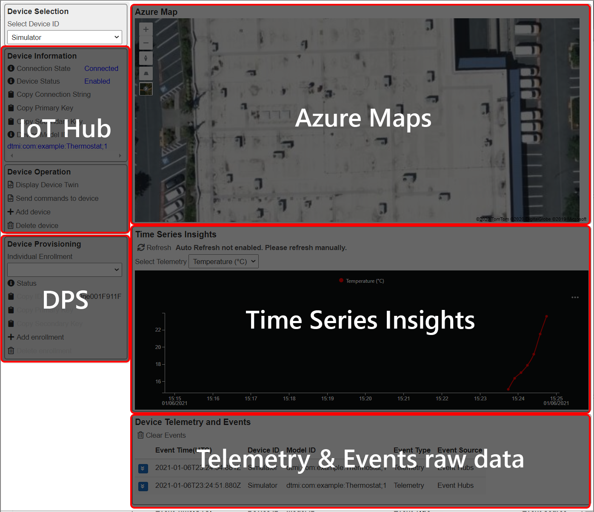
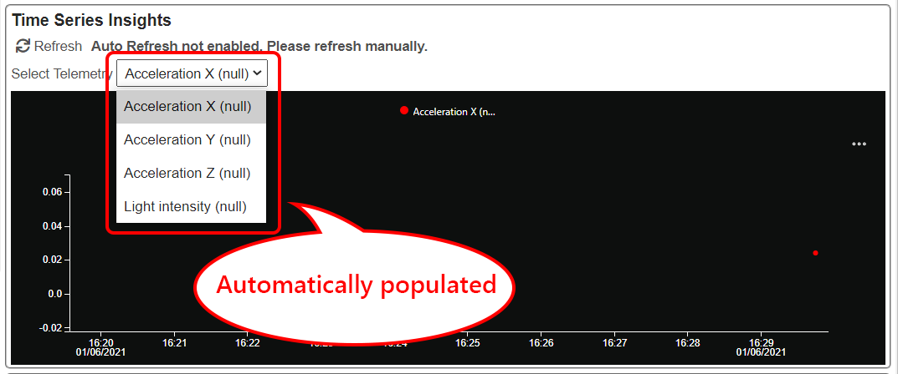
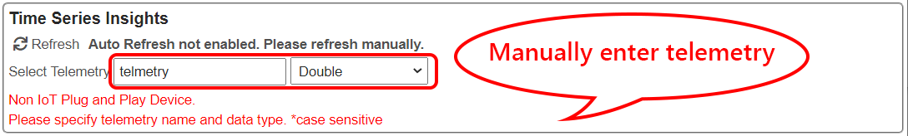

# Open Platform portal

There are 5 sections in the portal

## 1 : Azure IoT Hub

[Azure IoT Hub](https://docs.microsoft.com/en-us/azure/iot-hub/about-iot-hub) is a managed service, hosted in the cloud, that acts as a central message hub for bi-directional communication between your IoT application and the devices it manages.
Open Platform uses IoT Hub to connect devices to the solution, receive messages, manage devices, and send commands to devices (if devices support commands).

In IoT Hub section, you can :

- Select device
- Create or delete device identities
- View Device Connection String and Device Keys for the symmetric authentication
- View IoT Plug and Play Digital Twin Model ID (DTMI)
- Vies Device Twin  
    Editing Device Twin desired property is not yet supported
- Send Command  
    Supports IoT Plug and Play device only

## 2 : Device Provisioning Service

[Device Provisioning Service](https://docs.microsoft.com/en-us/azure/iot-dps/about-iot-dps) is a helper service for IoT Hub that enables zero-touch, just-in-time provisioning to the right IoT hub.
Open Platform uses DPS to provision devices to the solution, if a device supports DPS.

In DPS section, you can :

- View individual enrollment information such as ID Scope, Symmetric Key that are used to provision devices
- Add/Delete individual enrollments

## 3 : Azure Maps

[Azure Maps](https://docs.microsoft.com/en-us/azure/azure-maps/about-azure-maps) is a collection of geospatial services to provide location intelligence  

> [!NOTE]  
> By default, Open Platform deploys Azure Maps but does not use it.  Azure Maps is used for Azure Digital Twins demo.

## 4 : Time Series Insights (TSI)

You can use [Time Series Insights](https://docs.microsoft.com/en-us/azure/time-series-insights/overview-what-is-tsi) to collect, process, store, query and visualize data at Internet of Things (IoT) scale--data that's highly contextualized and optimized for time series.

- The portal reads data from TSI to visualize time series data in a line chart  
    The backend solution stores all telemetry from devices into TSI.  

- If the device supports IoT Plug and Play, the portal populates telemetry in the list

    

- If the device does NOT support IoT Plug and Play, manual entry of telemetry name and data type is required

    

## 5 : Raw Data

Open Platform receives raw data from the backend solution in real time.  There are two types of data, Telemetry and Events.
[Read More ](../Developer-Guide/Data-Ingestion-Data-Pipeline.md) on data types.

## Next Step

- [Connect a device](ConnectingDevice.md) to the Open Platform web application
- Developers : Learn more technical details of the Open Platform Open Platform Developer Guide : [Architecture Overview](../Developer-Guide/Architecture-Overview.md)

[Project 15 from Microsoft - Open Platform](../README.md)