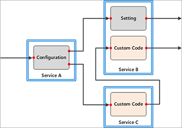
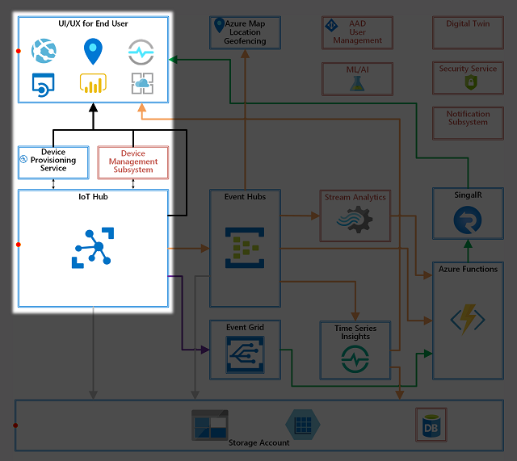
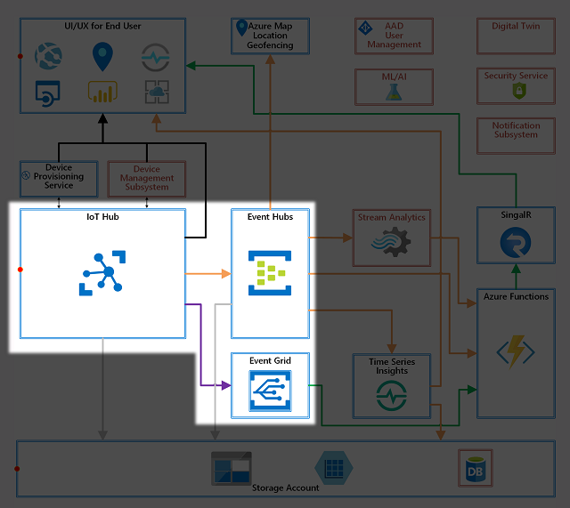
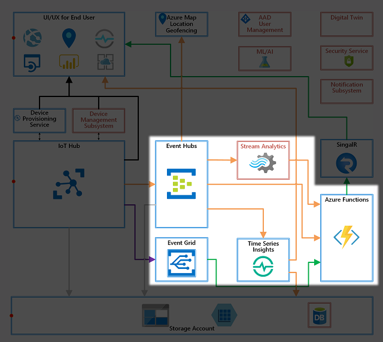
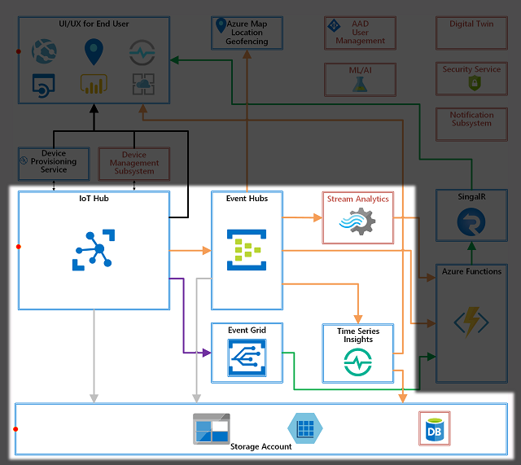
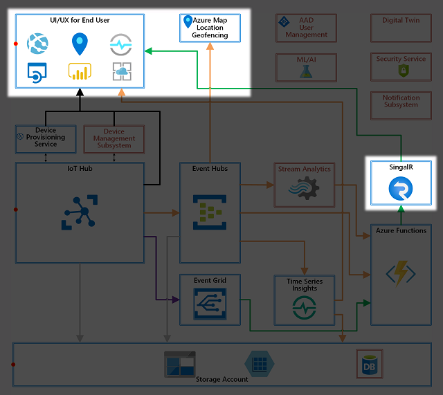

# Open Platform Developer Guide : Architecture Overview

Open Platform is consist of multiple Azure services and configurations/settings to :

- Enable Ready to go solution
- Provision devices using Device Provisioning Service
- Connect provisioned IoT Devices to IoT Hub
- Ingest telemetry and events from IoT devices
- Build a data pipeline necessary for basic telemetry and events processing
- Visualize IoT devices, telemetry, device events, and device management events in a web site
- Enable real time visualization using SignalR messaging
- Store and visualize IoT data using Time Series Insights
- Enable location based services using Azure Maps
- Build publish-subscribe model using Event Grid
- Secure the solution by setting security policies and access controls
- Exhibit examples of IoT Data visualization and basic device management

## Technical Goals and Requirements

The goals of the architecture and design are followings :

- Ready to go solution  
    A solution that is ready to accept data from devices
- Minimum manual operations  
    Automate deployment as much as possible to avoid manual operations
- Pre-configured as much as possible  
    Pre-configure as much as possible to avoid post deployment configurations

### IoT Application Structure Pattern

IoT solutions are built with a combination of Azure services.  Typically IoT solution architects makes decisions on :

- Selection of Azure services to meet requirements, or Hosting Environment  
    **Blue boxes** below
- Make logical connections between services
    This is often done by defining and/or configuring inputs and outputs (a.k.a. endpoints), and making connections.  
    **Red dots and arrows** below
- Configure services for specifics, such as access permission, data flow  
    Typically this is done through settings in each service.  
    **Gray boxes** below.
- Write software for custom processes  
    Some services are meant for developers to write custom software, some are not.  There are many options to run custom applications, and IoT architects need to select right services for the work.  
    **Pink boxes** below.

### Open Platform Design Principal

Considering IoT application structure pattern explained above, Open Platform is designed with 3 categories for it to be Ready-to-Go.

- Common Components  
    Every IoT solution requires a set of components/features to be functional. For example, all IoT solutions have devices connected, data to be ingested.

    Open Platform pre-configure these components.

- Common Components requires some customization  
    Each IoT solution requires some level of customization.  For example all IoT solutions receive data from IoT devices, but each IoT solution processes data differently.  
    Open Platform provides 

- Custom Components  
    Components that cannot be pre-configured.  However, Open Platform attempts to make it easy to add these components.

## Open Platform Design Overview

Open Platform designed is based on typical IoT use cases.  They are divided into following categories 

- IoT Device Management  
    Device provisioning and device management
- IoT data plumbing  
    data ingress and egress
- Data Pipeline  
    Typical data inflow and outflow from key Azure services and to data processing components
- Data Storage  
    Storage for various data types
- UI+UX  
    User interface, interaction, and visualization for end users

Each category is consist of **required** services and settings, **optional** services, and **customization** components.  

## IoT Device Management

IoT devices must be attested (validate their identities) to ensure devices are trustworthy and known.  
In order to provision IoT devices, there must be an agreement between cloud and IoT devices.  
The process of making the agreement and validating device identity is called device provisioning.  
As a part of the provisioning, the devices can, optionally, receive the initial configuration.

Once identity is validated, the device is allowed to be connected to the cloud via Azure IoT Hub.

More on IoT Device Management : [Open Platform Developer Guide : Device Provisioning](Device-Provisioning.md)

## Data Plumbing

Data generated by devices and sent to cloud must go through several steps before making value.

1. Receive data into Cloud through IoT Hub
1. Route messages to data pipeline, often called Data Ingestion
1. Send to data processing components for processing

More on Data Pipeline : [Open Platform Developer Guide : Data Ingestion and Data Pipeline](Data-Ingestion-Data-Pipeline.md)

## Data Pipeline

Ingested data must go through processing to be meaningful and take actions.  Raw data typically does not provide more than a fact, but data processing adds value.  
Data can be processed in different ways to be valuable.

- Filtering
- Analyzing
- Taking actions
- Modifying or combining

Open Platform provides foundations for typical data processing.

## Data Storage

Some Azure services such as Time Series Insights include data storage. Storing data can be done in may ways and formats.

Examples are :

- Raw data
- Aggregated data
- Processed data
- Analytic results
- Artificial Intelligence (AI) / Machine Learning (ML) inference results

Storage options must be carefully selected, as Azure storage services are often tuned for use cases.  Typically storage option decision starts with timeliness of data usage.

- Hot storage  
    Data is frequently accessed on fast storage
- Warm storage  
    Data is accessed less frequently than that on Hot Storage
- Cold storage  
    Data is rarely accessed on the slow storage

In addition, following considerations detemines data storage policy.

- When and how data should be stored
- Frequency of change
- Usefulness of data

Data is sent from one component to one or more storage options through **endpoints**.  Since data storage policy is highly dependent on types and nature of data, the data storage option is case-by-case.  
Open Platform provides multiple endpoint options to support various data storage options.

## UX + UI

User experience (UX) is often provided through User Interface (UI).  For example a web site to provide a dashboard, mobile app to receive notification, or a desktop application to input data.  
UI components are highly dependent on UX the solution wants to provide, use cases for the solution, and type of users.  Therefore, Open Platform exhibits some of UIs as examples through deploying and configuring a few Azure services.  

Typical UIs are :

- Visualization of data
- Realtime notification
- Device Management tasks
- Visualizing location Service/use cases

[Project 15 from Microsoft - Open Platform](../README.md)
