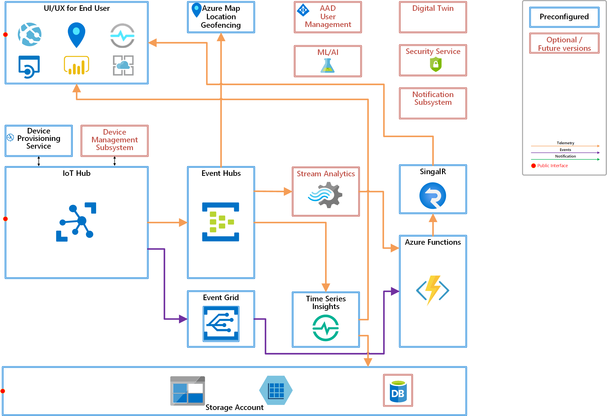

# Open Platform Developer Guide : Architecture Overview

Open Platform is consist of multiple Azure services and configurations/settings to :

- Enable Ready to go solution
- Provision devices using Device Provisioning Service
- Connect provisioned IoT Devices to IoT Hub
- Ingest telemetry and events from IoT devices
- Build a data pipeline necessary for basic telemetry and events processing
- Visualize IoT devices, telemetry, device events, and device management events in a web site
- Enable real time visualization using SignalR messaging
- Store and visualize IoT data using Time Series Insights
- Enable location based services using Azure Maps
- Build publish-subscribe model using Event Grid
- Secure the solution by setting security policies and access controls
- Exhibit examples of IoT Data visualization and basic device management

## Technical Goals and Requirements

The goals of the architecture and design are followings :

- Ready to go solution  

    A solution that is ready to accept data from devices

- Minimum manual operations

    Automate deployment as much as possible to avoid manual operations

- Pre-configured as much as possible

    Pre-configure as much as possible to avoid post deployment configurations

In order for a solution to be functional, the solution must include followings:

- Device provisioning
- Data ingress and igress
- Data processing, or Data Pipeline
- Storage for various data
- UX/UI for end users + Visualization

## Device Provisioning and Connection

IoT devices must be attested (validate their identities) to ensure devices are trustworthy and known.  
In order to provision IoT devices, there must be an agreement between cloud and IoT devices.  
The process of making the agreement and validating device identity is called device provisioning.  
As a part of the provisioning, the devices can, optionally, receive the initial configuration.

Once identity is validated, the device is allowed to be connected to the cloud via Azure IoT Hub.

More on Device Provisioning and Connection : [Open Platform Developer Guide : Device Provisioning](Device-Provisioning.md)

## Data Pipeline

Data generated by devices and sent to cloud must go through several steps before making value from them.

1. Accept data into Cloud through IoT Hub
1. Route messages to data pipeline, often called Data Ingestion
1. Pre-process
1. Consume data.  There are many ways to consume data.  Visualizing in Web portal dashboard, or send to the backend service components for further analysis
1. Send to data process and/or analytics layer, often called Insight
1. Take actions based on data point and/or analysis results

Data can be process in real-time or later time (post process)

More on Data Pipeline : [Open Platform Developer Guide : Data Ingestion and Data Pipeline](Data-Ingestion-Data-Pipeline.md)

## Architecture : Detail

[Project 15 from Microsoft | Open Platform](../README.md)