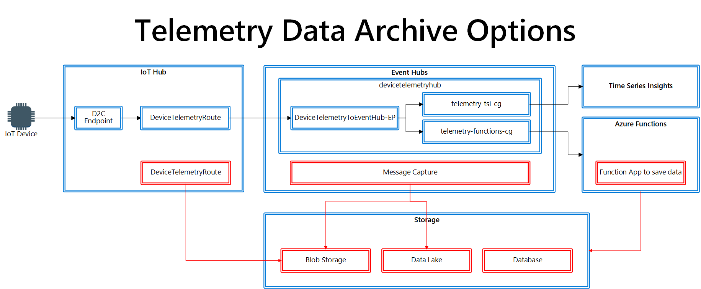

# Open Platform Developer Guide : Data Ingestion and Data Pipeline

## Data Ingress and Egress

Typical IoT devices generate 3 types of data.

- Telemetry
- Events
- Device Management

## Making sense of telemetry data

Telemetry data is often generated by or acquired from sensors, and sent to IoT solution with a fixed interval (called stream data) Typically each telemetry data point does not carry any insights.  They simply reports a fact at a point in time.  In other words, each data point has very little value.

Telemetry data is typically timestamped, and called **Time Series Data**.  

For example, in a temperature monitoring solution, temperature data is sent to the solution every minutes.  Every data point tells temperature measurement at a specific time, but they do not tell too hot or too cold.

Telemetry data sent to IoT Hub from devices (ingress) must be sent to the backend services (egress) to be consumed and create value.  

## Event Hubs

Azure Event Hubs is a big data streaming platform and event ingestion service.  It is tuned to receive and process millions of data per seconds.  Data received by an event hub can be transformed and stored by using any real-time analytics services such as Azure Stream Analytics.

## Telemetry Data Ingestion

Telemetry Data flow

1. IoT Hub **receives** telemetry data from a device through `D2C` endpoint
1. IoT Hub **routes** telemetry data to `DeviceTelemetryToEventHub-EP` using `DeviceTelemetryRoute` rule
1. Event Hub `devicetelemetryhub` receives telemetry data through `DeviceTelemetryToEventHub-EP` endpoint
1. Event Hubs, then, make telemetry data available for Time Series Insights and Azure Functions through Consumer Groups

## Processing Device Events to trigger action

Events are generated sporadically when a certain condition(s) is met.  Events do not carry why a specific event was generated.  Typically additional data points must be analyzed in order to make sense why a particular event was generated.  For example, a humidity sensor can generate an event saying "Humidity is 99%", or the sensor can notify the system **what** happened.  However, the event does not contain enough information why humidity became so high.  You may need external weather forecast data to understand **why**.

Events sent to IoT Hub from devices (ingress) must be sent to the backend services (egress) to be consumed and create value.  

In the Open Platform, all events received by IoT Hub is forwarded (or routed) to Event Hubs.

Devices send events in the same way they send telemetry.  Events and telemetry must be processed in different manners.

When a solution requires device event handling, consider adding property to the device data, and add another IoT Hub message routing to route to the appropriate service.

## Telemetry and Device Events Configuration Summary

| Service    | Purpose                      | Name                         |
|------------|------------------------------|------------------------------|
| IoT Hub    | Telemetry Input              | D2C Endpoint                 |
| IoT Hub    | Message Route Rule           | DeviceTelemetryRoute         |
| Event Hubs | Telemetry Input              | DeviceTelemetryToEventHub-EP |
| Event Hubs | Event Hub Instance           | devicetelemetryhub           |
| Event Hubs | Consumer Group for TSI       | Telemetry-tsi-cg             |
| Event Hubs | Consumer Group for Functions | Telemetry-functions-cg       |

### To Do

Add sample for message property

## Device Management Events

IoT Hub generates events on certain conditions :

1. When a device is created and deleted
1. When a device is connected and disconnected
1. When a settings and properties of a device is updated

Events generated by IoT Hub are sent to Event Grid for further process.  Depending on the requirements of the use cases, these device events must be processed.

As an example of subscribing events from Event Grid, the sample web site subscribes device management events in the Open Platform.  

## Device Management Events Configuration Summary

| Service    | Purpose              | Setting Name                      | Settings                                                                            |
|------------|----------------------|-----------------------------------|-------------------------------------------------------------------------------------|
| IoT Hub    | IoT Hub System Topic | IoTHubSystemTopic                 | Microsoft.Devices.DeviceCreated, DeviceDeleted, DeviceConnected, DeviceDisconnected |
| IoT Hub    | Message Route        | DeviceTwinChangeRoute             | Route to Build-in Endpoint                                                          |
| IoT Hub    | Message Route        | DeviceLifecycleRoute              | Route to Build-in Endpoint                                                          |
| IoT Hub    | Message Route        | DigitalTwinChangeRoute            | Route to Build-in Endpoint                                                          |
| Event Grid | Event Subscription   | DeviceManagemetnEventSUbscription | Subscription to the sample web site via WebHook (/api/eventgrid)                    |

The solution may also listen to device management events via Build-in endpoint.

## Device Telemetry storage and visualization

All telemetry and device events are sent to Time Series Insights (TSI) for visualization.  The sample web site runs query against TSI and displays line chart, using TSIClient Javascript library.
By default, telemetry and Device events are saved in Blob Storage as a cold storage.  You may optionally enable Warm Storage if required for better performance.

### Ingestion Rate

By default, the Open Platform is configured to support up to 1 mega byte per second.  If your use case requires more throughput, please upgrade TSI environment

More information on TSIClient : <https://github.com/Microsoft/tsiclient>
More information on TSI ingestion Rate : <https://docs.microsoft.com/en-us/azure/time-series-insights/concepts-streaming-ingress-throughput-limits>

## Potential Customization Options

More functionalities and user experiences can be added to the deployed solution depending on requirements.  Possible customizations are :

- Archiving telemetry and/or events
- Data processing logic
- More visualization
- Realtime Analytics
- Sharing data with another party

### Device Telemetry & Event archiving

The Open Platform uses TSI as a cold storage.  If your solution requires archiving telemetry and device events from IoT Devices, there are several options.

1. Send telemetry and/or device events to blob storage using IoT Hub Message Routing
1. Send telemetry and/or device events to Azure storage or Azure Data Lake Storage using Event Hubs message capture
1. Send telemetry and/or device events to any storage or database using Azure Functions

More information on Event Hubs Message Capture : <https://docs.microsoft.com/en-us/azure/event-hubs/event-hubs-capture-enable-through-portal>

> [!TIP]  
> Ensure to select appropriate storage / database services depending on use case  

By default, all telemetry and device events are stored in the blob storage through TSI.  The data pipeline in the Open Platform provides multiple ingestion points

- Directly from IoT Hub  
    Depending on data type, you may read (or listen to) telemetry and events using IoT Hub's built-in Event Hub Endpoints.  Add a new build-in endpoints to IoT Hub and receive data from the endpoint.  Ensure you also create a new consumer group for the new listner.
- From Event Hubs
    Read Telemetry and Device Events from Event Hubs by adding a new consumer group
- You may save telemetry and device events from IoT Hub to Blob Storage
- Event Hubs Event Capture
    Save events to storage such as Blob Storage and Data Lake using [Event Capture](https://docs.microsoft.com/azure/event-hubs/event-hubs-capture-overview)

### Data Processing Logic

Making sense of data is a way to create value from data.  In order to make sense of data, you need to process them.  Azure provides multiple options to process data.  Some of examples are :

- Azure Function  
    The Open Platform deploys Azure Functions to process telemetry.  You may add more functions to process more.  

- Logic Apps
- Power Apps
- Azure Machine Learning / AI
- Azure Stream Analytics for real-time analytics

To ingest data into additional processing units, create a subscription from Event Hubs by adding a new consumer group.

### More Visualization

You may add more visualizations.  Some of examples are :

- Realtime dashboard with PowerBi
- Web UI (Web site)
- Time Series Insights

### Realtime Analytics

If a solution requires (near) real-time analytics, consider adding Azure Stream Analytics (ASA).  ASA provides built-in Machine Learning (ML) capabilities such as anormal detection.

### Sharing Data with another party

The Open Platform does not provide external (or public) interface to share/exchange data with external sites/solutions.  You may add API interfaces such as REST API to publish and/or subscribe data to/from external data source.

[Project 15 from Microsoft : Open Platform](../README.md)
