# X.509 Certificate

## Digital Signature

The mechanism on how private and public key are used in validating data integrity is the basic concept for X.509 certificate.
There is a set of rules for the key pair logic.

## Symmetric Encryption vs. Asymmetric Encryption

Imagine a scenario you needs to send a sensitive document to your friend.  The basic method is to encrypt (or protect) with a password.  When your friend receives the document, he/she needs your password.  The question is how you want to share your password with your friend?  This is called Symmetric Encryption

Asymmetric Encryption is designed to solve this problem.  Asymmetric Encryption is how old fashion physical mailbox works.  This is achieved by generating a pair of key, called Private Key and Public Key.  They are mathematically linked to each other, called RSA algorithm.

Public Key is like the mailing address.  It's public and everyone can know.  
Private Key is like a key to the mailbox.  Only the owner of the mailbox keeps it.

Now with Private key and Public key, you can securely exchange the sensitive document.

1. Exchange **Public Key** (e.g. get your friend's mailing address)
1. Encrypt the sensitive document with **Private key** and send it to your friend.  (e.g. Seal your letter with Private Key)
1. Your friend receives the document and decrypt with **Public key** (E.g. Unlock the letter with your Public Key)

## Rules

- Only **Private key** can decrypt data encrypted with **Public key** (Private key cannot decrypt)
- Only **Public key** can decrypt data encrypted with **Private key** (Public key cannot decrypt)
- Private key is stored in a safe location (e.g. secure server)
- Public key is shared with clients
- Client encrypts data with the **Public key**.  => Only the intended server with the matching **Private key** can decrypt data.
- Server encrypts data with the **Private key**. => Only intended clients with the matching **Public key** can decrypt data.

## A key pair - Private Key and Public Key to encrypt and decrypt

The following is the steps to illustrate how the private key and the public key are used to ensure the data came from the trusted source, and contents are not modified.

1. Generate a key pair, **Private Key** and **Public Key**

    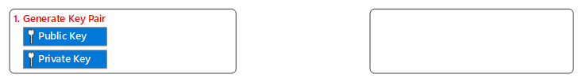

1. Public key must be shared with the other side of the communication.  

    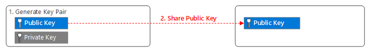

1. Prepare data that needs to be shared/sent to the receiver  

    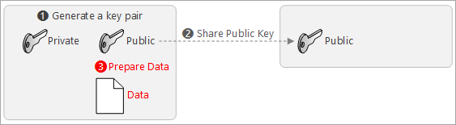

    > [!NOTE]
    > If you send data as is, there is no way to guarantee the integrity of data

1. Create a **signature** using **private key** and data  

    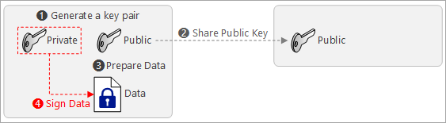

1. Send **data** with the **signature** to the receiver  

    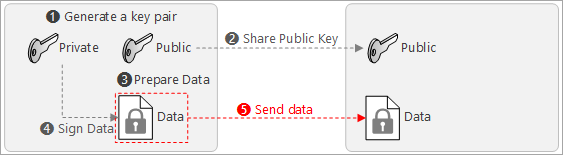

1. The receiver validates the integrity using public key  

    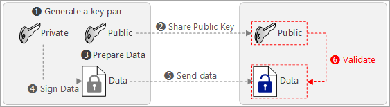

## Certificates

Now you can see how to validate the integrity of data using public key and private key.  Now the question is **How do I know my key is really valid?**

1. Generate a key pair, **Private Key** and **Public Key**

    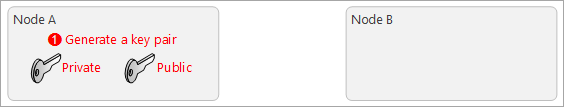

1. Public key must be shared with the other side of the communication.  

    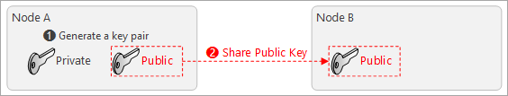

1. Now the question is, **How can I trust this key?**

    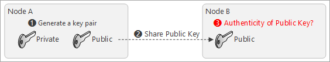

1. A 3rd party entity offers a service to prove the owner through a certification  

    The 3rd party entity act as a notary or a lawyer to prove you signed

    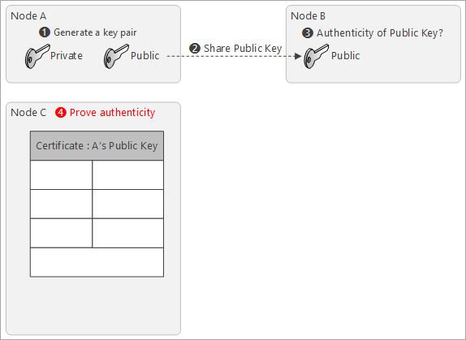

1. Copy A's Public Key in the certificate, and set **subject name**

    Subject name tells who owns the matching private key  

    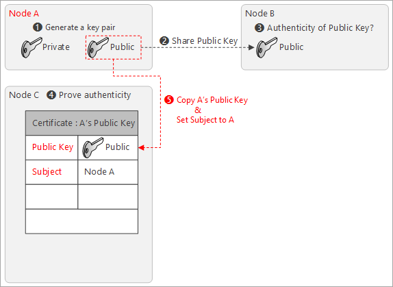

1. Set issuer of the certificate

    With this example, the issuer of the certificate is **Node C**

    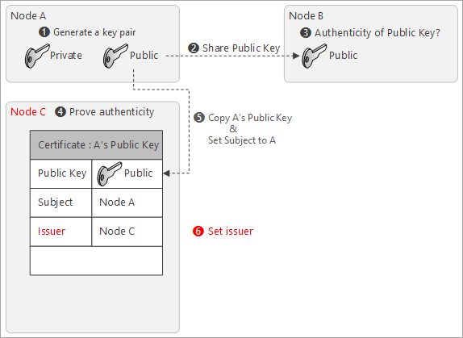

1. To ensure the authenticity of the certificate, Node C signs the certificate with its private key  

    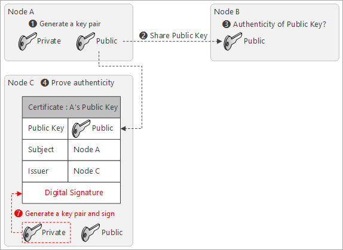

1. Send the certificate to Node B to validate A's public key  

    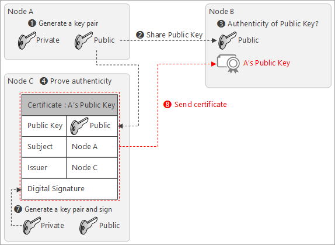

1. Node B needs Node C's public key to decrypt the certificate  

    In order to decrypt the certificate, Node B needs Node C's public key.  

    > [!TIP]  
    > Because the certificate is signed with C's Private Key, only C's public key can decrypt the certificate.

    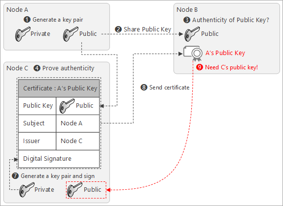

1. Another 3rd party entity offers a service to prove the ownership of C's Public Key  

    Repeat the step #4 ~ #8 with :

    - Public Key : C's Public Key
    - Subject : Node C
    - Issuer : Node D
    - Digital Signature : Sign with Node D's private key

    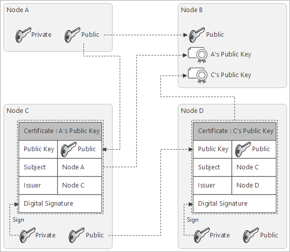

## Self Signed Certificate

You may ask "This is endless...?".  This time, Node D creates another certificate that can be used to validate Certificate for B's public key.

Create a new certificate with :

- Public Key : D's public key
- Subject : Node D
- Issuer : Node D
- Digital Signature : Sign with Node D's private key

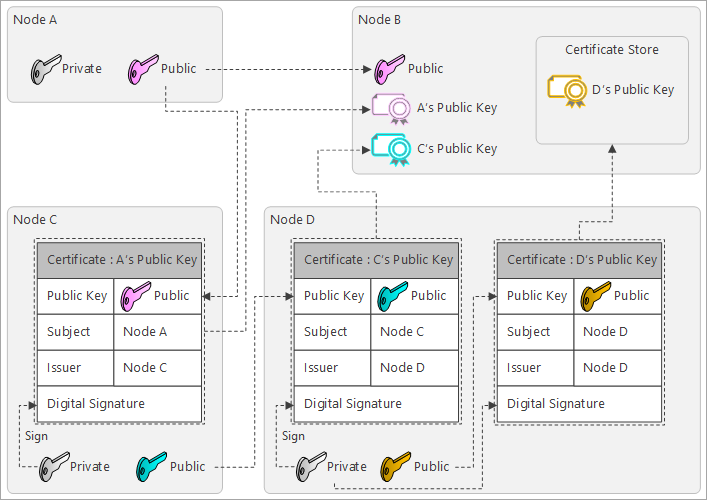

The certificate is signed with the private key that is to validate the matching public key.  Signing the public key with the matching private key is called **Self-Sign**.  A certificate with self-sign is called **self-signed certificate**.  

## Certificate Chain

As you can see multiple certificates are connected.  This is called **certificate chain**.

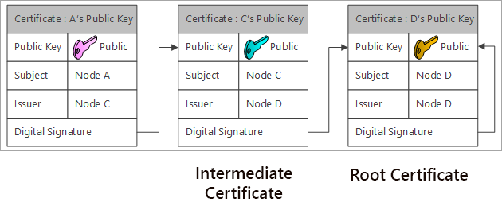

The self-signed certificate is the origin of the certificate chain, and it's called **root certificate**. The root certificate has to be installed to the system in advance as a trusted root certificate.  Trusted root certificates are pre-installed in the operating system's certificate store.

One or more certificates between the root certificate and the leaf certificates are called intermediate certificates.

[IoT Device Management](IoT-Device-Management.md)  
[Project 15 from Microsoft - Open Platform](../README.md)
