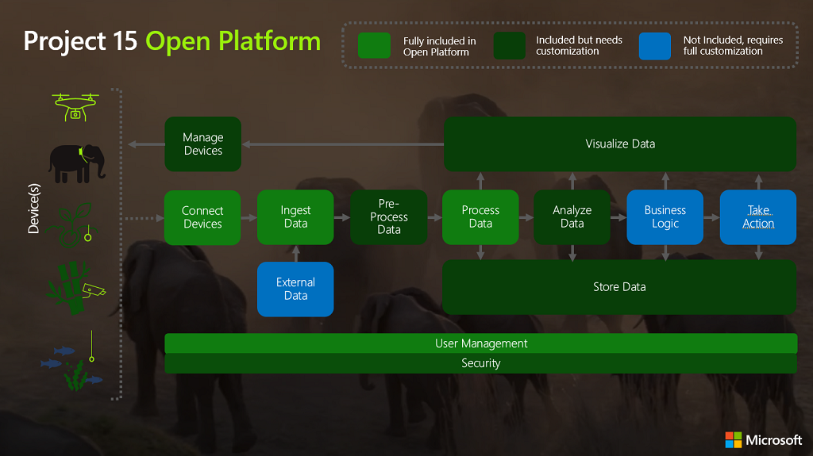

# Project 15 from Microsoft

Open Platform for Conservation and Ecological Sustainability Solutions

## About Project 15 from Microsoft

Project 15 started in April 2019 when Sarah Maston realized that a [safe schools solution](https://www.linkedin.com/pulse/what-project-edison-faqs-sarah-maston) she had invented could be used for an anti-poaching use case. That if we could connect the Scientific Community to our Technical Community more broadly we could accelerate innovation for scientists.  Watch the [Project 15 video](https://www.youtube.com/watch?v=0A4B2RIWb9o) to learn more.

| Quick Links                                          | Description                                                                                                                                  |
|------------------------------------------------------|----------------------------------------------------------------------------------------------------------------------------------------------|
| [Deploy](Deploy/Deployment.md)                       | Instructions to deploy the Project 15 Open Platform to Azure and configure into your Azure account (spoiler alert: It's a click of a button) |
| [Developer Guide](Developer-Guide/DeveloperGuide.md) | Double click into developing on the Project 15 Open Platform. Includes deep dive into the architecture and features.                  |

## About Project 15 Open Platform for Conservation and Ecological Sustainability Solutions

Our goal with a conservation and ecosystem sustainability open platform is to bring the latest Microsoft cloud and Internet of Things (IoT) technologies to accelerate  scientific teams building solutions like species tracking & observation, poaching prevention, ecosystem monitoring, pollution detection, etc.

The P15 Open Platform will get teams roughly 80% of the way to a finished solution.

The core goals of the P15 Open Platform are:

1. **Close the Skill Gap**  
    Boost innovation with a ready-made platform, allowing the scientific developer to expand into specific use cases.
1. **Increase Speed to Deployment**  
    Open Platform get teams 80% of the way with their projects, dramatically reducing the time to start building crucial insights.
1. **Lower the development cost**  
    The Open Platform lowers the cost of overall development and reduces complexity. Opens up opportunities for partnering with the Open Source developer community and universities.

With deployment to Azure in a **push of a button**, the main components of the infrastructure for a standard IoT Solution will be up and running.  We have documented some of the common scenarios for simulation of device data, connection of a device, and we will be working over time to create more enablement content through our [Project 15 YouTube Channel](https://aka.ms/project15video) and other Microsoft Learning channels.   If you have a specific scenario you need help with, please submit an [issue ticket](https://docs.github.com/en/desktop/contributing-and-collaborating-using-github-desktop/creating-an-issue-or-pull-request).  

If you would like to contribute a feature or module to the Project 15 repo, submit a [pull request](https://docs.github.com/en/desktop/contributing-and-collaborating-using-github-desktop/creating-an-issue-or-pull-request).  
We are in the process of creating a list of known use cases with our scientific partners, a list of problems to be solved. Coming soon!

## Solution Overview

The solution has three main categories

1. **Components that are full included**  
    These are Azure services that if someone was standing up the solution these parts of the infrastructure only need to be deployed once and then expanded as devices get added to the solution. To learn all the ins and outs of these services is a lift and would take time. Our theory here is that by this method, the technologist doesn't need to know every nitty-gritty detail and can expand their learning as needed. For learning about building an IoT Solution, a great resource to ramp up quickly on the concepts with real world examples and labs is available at [Internet of Things Learning Path](https://aka.ms/iotlp). Of course, if one wants to learn all the details, Microsoft Learn's [Introduction to Azure IoT](https://docs.microsoft.com/learn/paths/introduction-to-azure-iot/) has all you need. All our learning resources here, are free to you.  

1. **Included Components but needs customization**  
    Here the solution will deploy these services for you, but you will start to modify and add to them based on your use case. The details of the services here are all explained in our [Project 15 Open Platform Developer Guide](Developer-Guide/DeveloperGuide.md). The high level architecture of what services are involved, see blow.  

1. **Not Included, requires full customization**  
    This is the part where your IP will reside.  How this works is once you Deploy the solution to your own Azure account, **it is yours to build out**. Think of how you use a word processor. The word processor is a tool and the book you write, is yours. Meaning the story you publish is yours, the revenue generated is yours. Same idea. This solution is a tool for you to use to write your own solutions. We are here to help enable you to use it and we will evolve new features over time and let you know so you can bring them in to your solution if you like. We are creating instructions and best practices around "How do I fork this repo to make my own solution but keep getting any updates from the main repo?"  

### Solving for Roadblocks

When we started meeting scientists leading a variety of different projects we started to see some patterns. Identifying "why do these critical projects stall?" By our estimation the stall factor fell into six main categories. Not only were scientific technologists re-inventing wheels that already existed "in industry" as explained in Sarah's article [A thought exercise :: What does a Sustainability Vertical for IoT Solutions have to do with a word processor?](https://www.linkedin.com/pulse/thought-exercise-what-does-sustainability-vertical-iot-sarah-maston).
What we realized is that not only could our partner ecosystem help to drive these projects forward but we, ourselves, as developers could create an Open Platform to help.

If you are more familiar with the commercial side of IoT Solutions, you will see right away that these roadblocks are familiar. These are problems that for years Microsoft has been working to solve and has come out with a portfolio of tools and services that make IoT solutioning less complex.  But for scientifically based projects, there is a nuance to the business model in that it is mostly grant funded. With that model, we needed to rethink how to accelerate the time to market.  

### Solution Accelerator Architectural

Our [Developer's Guide](Developer-Guide/DeveloperGuide.md) is the resource to double-click into the details on the P15 Open Platform services.

For a quick start guide to deployment, please visit our [Deployment Guide](Deploy/Deployment.md).

## Resources

| Resource Link                                                      | Description                                                                                                                                                                         |
|--------------------------------------------------------------------|:------------------------------------------------------------------------------------------------------------------------------------------------------------------------------------|
| [The Project 15 Channel on YouTube](https://aka.ms/project15video) | A channel that will feature videos highlighting "how to", project spotlights, and other stories about leveraging IoT and AI/ML on Azure for driving conservation and sustainability |
| [AI for Earth](https://aka.ms/aiforearth)                           | Learn about Microsoft's AI for Earth. The array of technical resources available and the grant program.                                                                             |
| [Internet of Things Event Learning Path](https://aka.ms/iotlp)      | A five module course to learn the concepts of creating a scalable IoT solution on Azure.                                                                                            |
| [Microsoft Learn](https://aka.ms/learn)                             | Microsoft's comprehensive and free learning platform                                                                                                                                |

## FAQs

Coming soon!  

## About The Project 15 Team

The team is actually a big "v-team"virtual team) that has grown to touch many groups across Microsoft. It would be hard to list all the people that have helped in their weekend hours and spare time internally. It is Microsoft's mission to "Empower every person on the planet to achieve mor (e."  We released this Open Platform in the hopes it would be the bridge between the open source developer community and the scientific community. Accelerating development at a time where we all need to be all hands on deck to fix our Earth.  

This project started about a year and a half ago, it is 9/15/2020 at the time of this writing, as a "what if?" when Sarah had her aha moment that commercial IoT Solutions and devices could help the scientific community. If you ask her, she will tell you about a side conversation with Eric Dinerstein and how she didn't have a clue how to save an Elephant. But she gave him her word that if she could figure out a way to get an "army of nerds" like her to help him and his colleagues, she would.  

We hope you will join us!  

| The Project 15 Principal Team Members                                      | Role                                                                   |
|----------------------------------------------------------------------------|:-----------------------------------------------------------------------|
| [Pamela Cortez](https://www.linkedin.com/in/pamelacortezhellotechie/)      | Architect, Community Lead                                              |
| [Sarah Maston](https://www.linkedin.com/in/smwmaston/)                     | Architect, Product Manager, Co-founder of Project 15                   |
| [Daisuke Nakahara](https://www.linkedin.com/in/daisuke-nakahara-0a997818/) | Lead Architect for Project 15 Open Platform, Co-founder of Project 15  |
| [Anders Zwartjes](https://www.linkedin.com/in/anderszwartjes/)             | Project Stratigist, Marketer, Storyteller                              |                     
| [Lee Stott](https://www.linkedin.com/in/leestott/)                         | Academic Partnerships and Microsoft Learn Student Ambassadors Community|

| The Project 15 Project Sponsors                                   | Role                                                               |
|-------------------------------------------------------------------|:-------------------------------------------------------------------|
| [Rodney Clark](https://www.linkedin.com/in/rodney-clark-4b69b16/) | Corporate Vice President, IoT and Mixed Reality Sales at Microsoft |
| [Analisa Roberts](https://www.linkedin.com/in/analisa-roberts/)   | Senior Director, Azure IoT Marketing at Microsoft                  |

